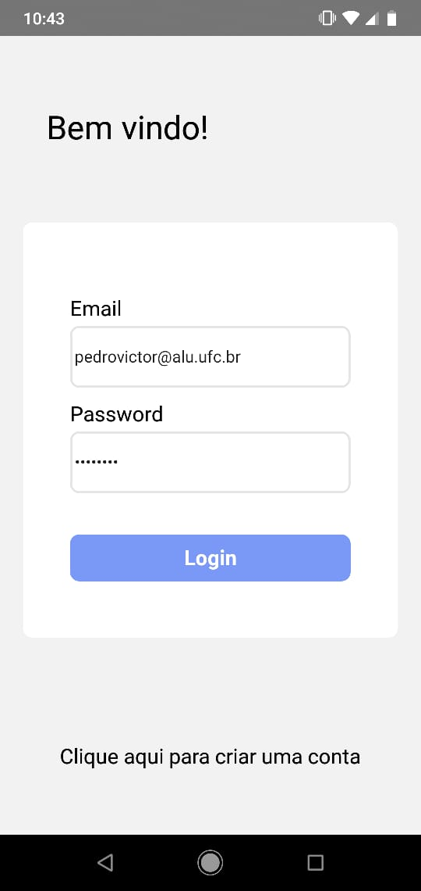
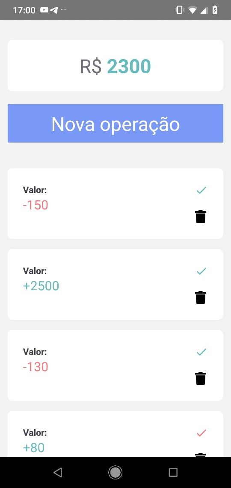
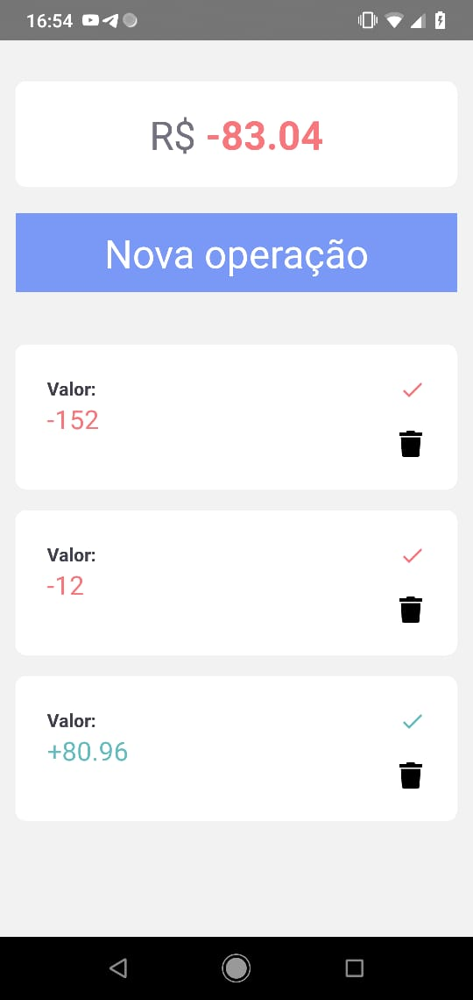
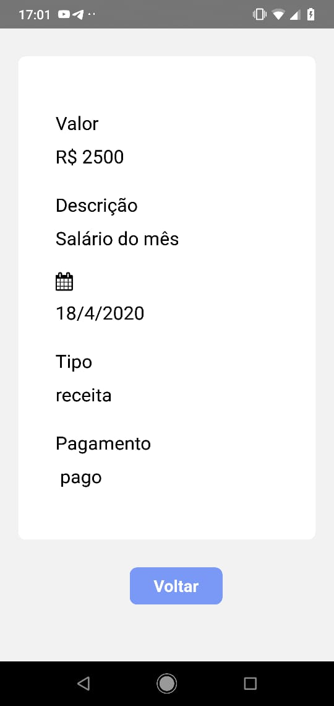
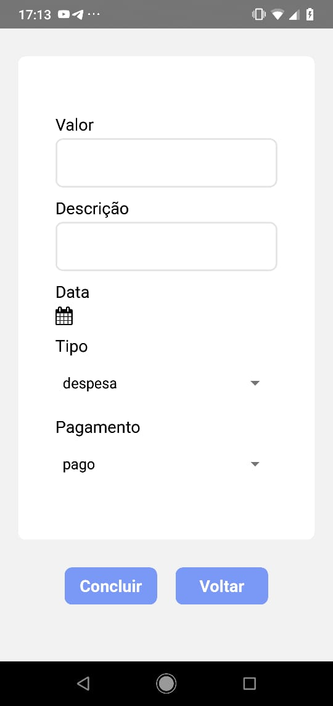
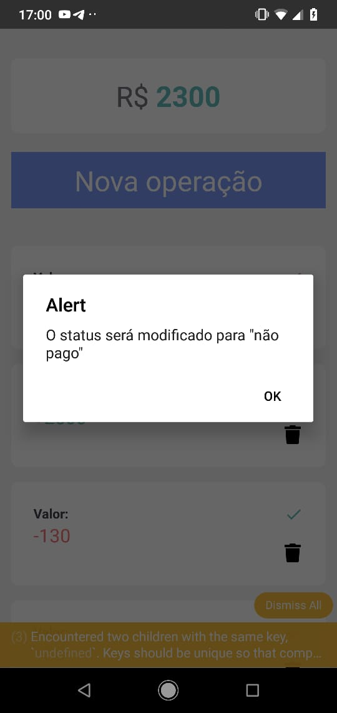
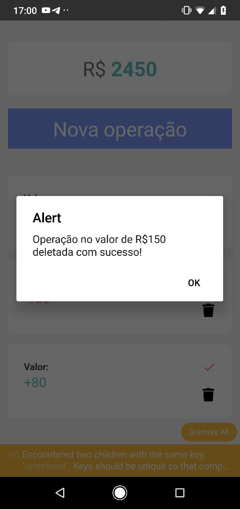

# MobillsProject
Projeto de gestão de finanças pessoais

# Use react-native link react-native-vector-icons

# Login

# Cadastro

# Main Saldo Positivo

# Main Saldo Negativo

# Detalhes

# Nova Operação

# Mudando status de pagamento para 'não pago'

# Exclusão De Operação

